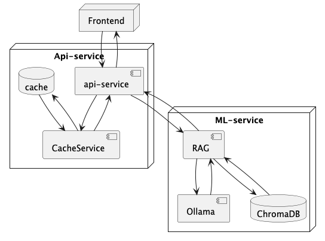
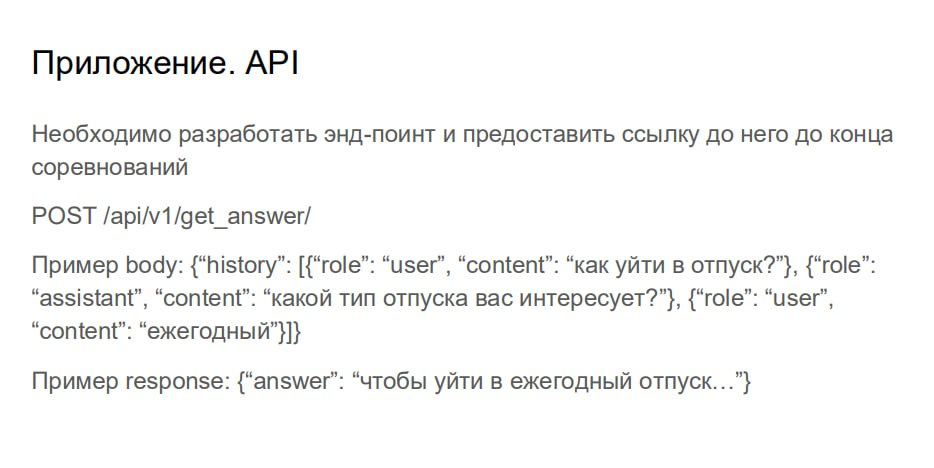

# DeltaBot - Чат-бот для технической поддержки X5 Retail Group
Чат-бот для консультаций сотрудников орагнизации X5 Retail Group по интересующим вопросам.

Цель бота - снизить нагрузку на сотрудников 1-й линии технической поддержки (1ЛТП)

## Cодержание
- [Технологии](#технологии)
- [Архитектура сервиса](#архитектура-сервиса)
- [Запуск сервиса](#запуск-сервиса)
- [Сценарии использования](#сценарии-использования)
- [Команда проекта](#команда-проекта)

## Технологии
- Бэкенд

  API - FastApi
  
  Библиотека для работы с БД - SQLAlchemy
  
  Сервис кэширования - Redis
  
  Брокер сообщений - RabbitMQ (в развитие)
  
  Балансировщик - Nginx
  
- Модель
  
  RAG - ruBERTtiny v.2
  
  LLM - Gemma2 9B
  
  Векторная БД - ChromaDB
  
- Интерфейс
  
  UI - Streamlit

## Архитектура сервиса



## Запуск сервиса

# Запуск

1) Клонируйте репозиторий проекта:

``` bash
git clone https://github.com/Marsupilami-it/Chat_Bot_X5.git
```

2. Перейдите в директорию проекта:

``` bash
cd Chat_Bot_X5
```

3. Выполните команду ls и убедитесь, что вывод соответствует:
```
Dockerfile.api          docker-compose.yml      requirements.txt
Dockerfile.ui           outter_api.py           ui.py
```

4. Постройте и запустите контейнеры с помощью Docker Compose:
``` bash
docker-compose up --build -d
```
5. Проверьте статус запущенных контейнеров:

``` bash
docker-compose ps
```

6. Откройте браузер и перейдите по адресу:
```
http://localhost:8501
```

Если вы запускаете приложение на удаленном сервере, замените localhost на IP-адрес вашего сервера.


# Тестирование API
Запустив Docker контейнеры можно обращаться к чат боту двумя способами:
1) через ui интефрейс. Для этого зайти на сайт http://localhost:8501/ либо 51.250.79.164 (хост сервер)
2) прокидывать POST запросы. Для этого откройте postman или любой другой источник в поле адрес укажите ```
POST http://localhost:8003/api/v1/get_answer/  ```
Тело сообщения может быть в формате истории общения пользователя с чат-ботом. Пример body ниже
``` json 
{
  "history": [
    {
      "role": "user",
      "content": "Добрый день! Хотел бы уточнить, как можно оформить отпуск в следующем месяце?"
    },
    {
      "role": "assistant",
      "content": "Здравствуйте! Для оформления отпуска вам нужно заполнить заявление на отпуск и согласовать даты с руководителем. После этого заявление отправляется в отдел кадров для оформления приказа."
    },
    {
      "role": "user",
      "content": "Спасибо! Есть ли ограничения по продолжительности отпуска?"
    },
    {
      "role": "assistant",
      "content": "Обычно отпуск предоставляется на срок до 28 календарных дней в год. Однако, вы можете разбить его на несколько частей, при этом одна из частей не может быть меньше 14 дней."
    },
    {
      "role": "user",
      "content": "Понял. А можно ли перенести часть отпуска на следующий год?"
    }
  ]
}

```
Вы получите ответ в такой структуре JSON. Берете message и в нем первое значение content
```
{
    "model": "gemma2:9b",
    "created_at": "2024-09-13T07:08:19.133418679Z",
    "message": {
        "role": "assistant",
        "content": "Ознакомиться с графиком отпусков и воспользоваться доступным для планирования лимитом Вы можете разделе «Отпуска». Обращаем внимание, что в Личном кабинете отображаются доступные лимиты за вычетом уже запланированных дней. \n\n\n"
    },
    "done_reason": "stop",
    "done": true,
    "total_duration": 25113630279,
    "load_duration": 16617390458,
    "prompt_eval_count": 1392,
    "prompt_eval_duration": 2011579000,
    "eval_count": 58,
    "eval_duration": 3905974000
}
```
Требования из кейса к API



Контакты:
По вопросам запуска обращайтесь в ТГ @andrew_eu

## Cценарии использования

Описание сценариев использования чат-бота со стороны пользователя

#### Первый сценарий - бот корректно ответил на вопрос пользователя:
   1. Пользователь начинает общение с ботом, пишет "Привет"
   2. Бот отвечает, задавая вопрос "Чем я могу помочь?"
   3. Пользователь отправляет вопрос пользователю
   4. Бот предоставляет ответ
   5. Ответ является корректным, пользователь удовлетворен

#### Второй сценарий - бот с 1 раза не смог корректно ответить на вопрос пользователя:
   1. Пользователь начинает общение с ботом, пишет "Привет"
   2. Бот отвечает, задавая вопрос "Чем я могу помочь?"
   3. Пользователь отправляет вопрос пользователю
   4. Бот предоставляет ответ
   5. Ответ является некорректным, пользователь пишет боту о некорректном ответе
   6. Бот приносит извинения за некорретный ответ и просит задать вопрос иначе
   7. Повторяется процесс по пунктам 4-6 не более 2 раз до момента получения пользователем корректного ответа
   8. Ответ удовлетворяет пользователя

#### Третий сценарий - бот не смог дать ответ и передал вопрос специалисту:
   1. Пользователь начинает общение с ботом, пишет "Привет"
   2. Бот отвечает, задавая вопрос "Чем я могу помочь?"
   3. Пользователь отправляет вопрос пользователю
   4. Бот предоставляет ответ
   5. Ответ является некорректным, пользователь пишет боту о некорректном ответе
   6. Бот приносит извинения за некорретный ответ и просит задать вопрос иначе
   7. Повторяется процесс по пунктам 4-6, при предоставлении 3-х ответов, не удовлетворяющих пользователя, бот приносит извинения "Приношу извинения, что не смог помочь, передаю ваш вопрос специалисту"
   8. Дальнейшую работу по обращению ведет специалист

## Команда проекта
- Жиров Андрей - Product Manager
- Ларина Нина - System Architect
- Устинов Андрей - Data Science
- Бокарев Степан - Backend Developer
- Григорьев Игорь - Backend Developer
